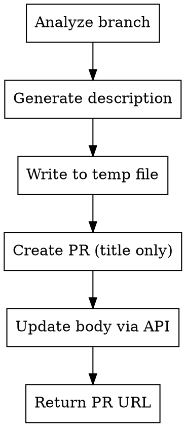

# Create PR with Auto-Generated Description

Creates a pull request with a well-structured description based on analyzing the current branch changes.

## When to Use

- After completing feature work and wanting to open a PR
- When you want a consistent PR description format
- When shell escaping issues prevent inline PR body creation

## Workflow



### Step 1: Analyze Branch Changes

```bash
# Get branch info
git log main..HEAD --oneline
git diff main...HEAD --stat

# Get changed files
git diff main...HEAD --name-only

# Get recent commits for context
git log main..HEAD --pretty=format:"%s%n%b"
```

### Step 2: Generate PR Description

Use the embedded template below. Fill in each section based on the analysis:

**Template:**
```markdown
## Background (Why)

[Describe the problem being solved. Why is this PR needed?]

## Implementation Approach (How)

[Describe the technical approach and key architectural decisions.]

## Changes Made

- [x] Change 1
- [x] Change 2

### Screenshots or Video References

[N/A or add references]

### Testing Verification

- [ ] Test scenario 1
- [ ] Test scenario 2

## Additional Notes

[Known limitations, future work, or helpful context for reviewers]

## Related Links

- [Links to issues, docs, or related PRs]
```

### Step 3: Write Body to Temp File

**CRITICAL:** Never use HEREDOC with `gh pr create --body`. Shell escaping fails silently with complex markdown.

```bash
# Write the generated description to a temp file
# (Use the Write tool to create /tmp/pr-body.md)
```

### Step 4: Create PR and Update Body

```bash
# Option A: Use --body-file (preferred if available)
gh pr create --title "PR Title" --body-file /tmp/pr-body.md

# Option B: Create then update via API (fallback)
gh pr create --title "PR Title" --body ""
gh api repos/{owner}/{repo}/pulls/{number} -X PATCH -F body=@/tmp/pr-body.md
```

## Quick Reference

| Step | Command/Action |
|------|---------------|
| Analyze changes | `git log main..HEAD`, `git diff main...HEAD --stat` |
| Write body | Write tool → `/tmp/pr-body.md` |
| Create PR | `gh pr create --title "..." --body-file /tmp/pr-body.md` |
| Fallback update | `gh api repos/{owner}/{repo}/pulls/{n} -X PATCH -F body=@/tmp/pr-body.md` |

## Common Mistakes

| Mistake | Fix |
|---------|-----|
| Using HEREDOC for body | Write to file, use `--body-file` or API |
| PR created with "No description" | Update via `gh api` with `-F body=@file` |
| Token permission errors on `gh pr edit` | Use `gh api` directly instead |
| Not analyzing all commits | Use `git log main..HEAD` not just latest commit |

## Lessons Learned

1. **HEREDOC fails silently** - Complex markdown with backticks/quotes doesn't survive shell escaping
2. **`gh pr edit` may lack permissions** - The API approach (`gh api -X PATCH`) works more reliably
3. **`-F body=@filename`** - The `@` prefix reads file contents directly, avoiding all escaping issues
4. **Always verify** - Check the PR page after creation to confirm description rendered

## Template Customization

To use a project-specific template:

1. Check for `.github/PULL_REQUEST_TEMPLATE/feature.md` or similar
2. Read the template structure
3. Adapt the generated content to match the template format

Projects may have templates at:
- `.github/PULL_REQUEST_TEMPLATE.md`
- `.github/PULL_REQUEST_TEMPLATE/feature.md`
- `.github/PULL_REQUEST_TEMPLATE/bugfix.md`
