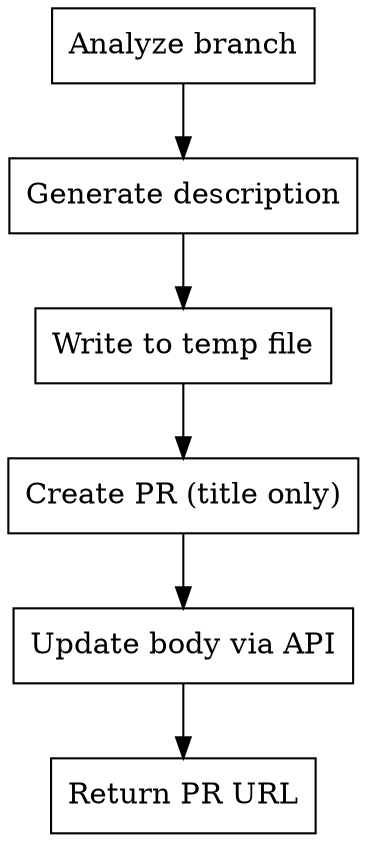

# Create PR with Auto-Generated Description

Creates a pull request with a well-structured description based on analyzing the current branch changes.

## When to Use

- After completing feature work and wanting to open a PR
- When you want a consistent PR description format
- When shell escaping issues prevent inline PR body creation

## Workflow


```dot
digraph create_pr {
    "Analyze branch" [shape=box];
    "Generate description" [shape=box];
    "Write to temp file" [shape=box];
    "Create PR (title only)" [shape=box];
    "Update body via API" [shape=box];
    "Return PR URL" [shape=box];

    "Analyze branch" -> "Generate description";
    "Generate description" -> "Write to temp file";
    "Write to temp file" -> "Create PR (title only)";
    "Create PR (title only)" -> "Update body via API";
    "Update body via API" -> "Return PR URL";
}
```

### Step 1: Analyze Branch Changes

```bash
# Get branch info
git log main..HEAD --oneline
git diff main...HEAD --stat

# Get changed files
git diff main...HEAD --name-only

# Get recent commits for context
git log main..HEAD --pretty=format:"%s%n%b"
```

### Step 2: Generate PR Description

Use the embedded template below. Fill in each section based on the analysis:

**Template:**
```markdown
## Background (Why)

[Describe the problem being solved. Why is this PR needed?]

## Implementation Approach (How)

[Describe the technical approach and key architectural decisions.]

## Changes Made

- [x] Change 1
- [x] Change 2

### Screenshots or Video References

[N/A or add references]

### Testing Verification

- [ ] Test scenario 1
- [ ] Test scenario 2

## Additional Notes

[Known limitations, future work, or helpful context for reviewers]

## Related Links

- [Links to issues, docs, or related PRs]
```

### Step 3: Write Body to Temp File

**CRITICAL:** Use the `Write` tool to create `/tmp/pr-body.md`. NEVER use shell heredoc (`cat << EOF`), `echo`, or any bash command to write the file — shell aliases and escaping silently produce empty files.

```
Use the Write tool → /tmp/pr-body.md
```

**After writing, VERIFY the file has content:**
```bash
wc -c /tmp/pr-body.md
# Must show > 0 bytes. If 0, the write failed silently.
```

### Step 4: Create PR with Body

```bash
gh pr create --title "PR Title" --body-file /tmp/pr-body.md
```

**After creation, VERIFY the description exists:**
```bash
gh api repos/{owner}/{repo}/pulls/{number} --jq '.body | length'
# Must show > 0. If 0, the body was empty.
```

If the body is missing, update via API using Python (not shell) to avoid escaping issues:
```bash
python3 -c "
import json, urllib.request, subprocess
token = subprocess.run(['gh', 'auth', 'token'], capture_output=True, text=True).stdout.strip()
with open('/tmp/pr-body.md') as f: body = f.read()
data = json.dumps({'body': body}).encode('utf-8')
req = urllib.request.Request(
    'https://api.github.com/repos/{owner}/{repo}/pulls/{number}',
    data=data, method='PATCH',
    headers={'Authorization': f'token {token}', 'Accept': 'application/vnd.github.v3+json', 'Content-Type': 'application/json; charset=utf-8'}
)
resp = urllib.request.urlopen(req)
print('Body length:', len(json.loads(resp.read()).get('body', '')))
"
```

## Quick Reference

| Step | Command/Action |
|------|---------------|
| Analyze changes | `git log main..HEAD`, `git diff main...HEAD --stat` |
| Write body | **Write tool** (NEVER bash) → `/tmp/pr-body.md` |
| Verify file | `wc -c /tmp/pr-body.md` — must be > 0 bytes |
| Create PR | `gh pr create --title "..." --body-file /tmp/pr-body.md` |
| Verify body | `gh api repos/.../pulls/{n} --jq '.body \| length'` — must be > 0 |
| Fallback update | Python script (see Step 4) — NOT `gh api -F body=@file` |

## Common Mistakes

| Mistake | Fix |
|---------|-----|
| Using HEREDOC/cat/echo to write body file | **Always use Write tool.** Shell aliases (`_safe_eval`) silently produce 0-byte files |
| Not verifying file has content after writing | Run `wc -c` immediately after writing |
| Not verifying PR body after creation | Run `gh api --jq '.body \| length'` after `gh pr create` |
| PR created with "No description" | Update via Python urllib (see Step 4), NOT `gh api -F body=@file` |
| Token permission errors on `gh pr edit` | Use `gh api` REST directly instead |
| Using `gh api -F body=@file` to update body | This silently fails with some content. Use Python urllib instead |
| Not analyzing all commits | Use `git log main..HEAD` not just latest commit |

## Lessons Learned

1. **Shell file writes fail silently** — Custom shell configs (`_safe_eval`, `scmb`) intercept `cat`, `echo`, heredocs. The file is created at 0 bytes with no error. Always use the Write tool.
2. **Verify twice** — Check file size after writing, check body length after PR creation. Both can silently succeed with empty content.
3. **`gh pr edit` may lack token scopes** — Use REST API (`gh api -X PATCH`) instead.
4. **Python for API fallback** — When `gh api -F body=@file` doesn't work, use Python `urllib.request` with `json.dumps({'body': content})` to handle encoding correctly.

## Template Customization

To use a project-specific template:

1. Check for `.github/PULL_REQUEST_TEMPLATE/feature.md` or similar
2. Read the template structure
3. Adapt the generated content to match the template format

Projects may have templates at:
- `.github/PULL_REQUEST_TEMPLATE.md`
- `.github/PULL_REQUEST_TEMPLATE/feature.md`
- `.github/PULL_REQUEST_TEMPLATE/bugfix.md`
