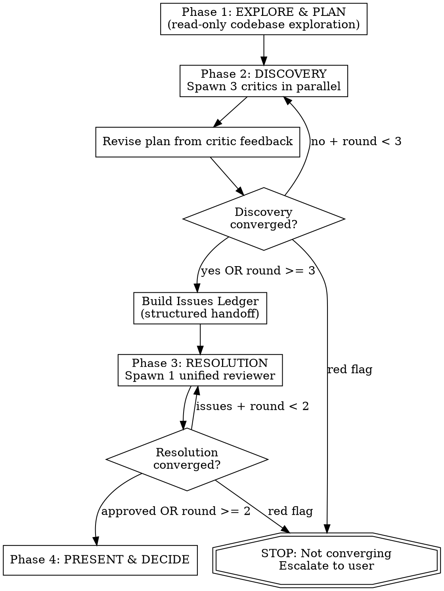

# Critique Loop Skill

## Overview

Automated plan-critique-converge cycle that replaces Claude Code's plan mode.
Two-phase review: multi-persona **Discovery** for breadth, then unified **Resolution** for depth.

## When to Use

- Multi-file implementation requiring architectural decisions
- Plans involving external library integrations or cross-boundary data contracts
- Any task where a missed issue would be expensive to fix during implementation

**When NOT to use:**
- Single-file changes or simple bug fixes → regular plan mode
- Quick review of an existing plan → `critique-plan` skill
- Tasks with clear, well-specified requirements and no ambiguity

## Quick Reference

| Phase | Agents | Max Rounds | Convergence |
|-------|--------|------------|-------------|
| 1. Explore & Plan | 0 (you) | 1 | Plan written to disk |
| 2. Discovery | 3 per round | 3 | Zero CRITICAL/REMOVE + MAJOR/SIMPLIFY/IMPORTANT ≤ 2 |
| 3. Resolution | 1 per round | 2 | All ledger items verified + zero new CRITICAL/MAJOR |
| 4. Present & Decide | 0 (you) | 1 | User approval |

**Best case:** 4 agents (1 Discovery + 1 Resolution). **Worst case:** 11 agents (9 + 2).

## Flow



## Invocation

```
/critique-loop <task description>
/critique-loop --resume docs/plans/YYYY-MM-DD-<topic>-design.md   # skip Phase 1
```

## Phase 1: EXPLORE & PLAN

**Mode**: Read-only. DO NOT write implementation code.

**Tools allowed**: Read, Glob, Grep, WebSearch, WebFetch

1. Explore the codebase to understand structure, patterns, and constraints
2. Research any external dependencies or APIs needed
3. Write a plan to `docs/plans/YYYY-MM-DD-<topic>-design.md`
4. Include: architecture, tech stack, data flow, project structure, env vars, extension points
5. Apply YAGNI ruthlessly

## Phase 2: DISCOVERY

Goal: Find all issues through multi-perspective review with clean context.

### Step 1: Spawn Critics

Spawn three Task agents **in parallel** using `subagent_type: general-purpose`.

Each critic prompt uses the shared evidence preamble + role-specific checklist from `critic-prompts.md`. Pass `{task_description}` and `{plan_content}` as template variables.

| Critic | Focus | Severities |
|--------|-------|------------|
| Devil's Advocate | What's MISSING or could BREAK | CRITICAL, MAJOR, MINOR |
| Pragmatist | What's UNNECESSARY or OVER-ENGINEERED | REMOVE, SIMPLIFY, DEFER, NIT |
| Contract Auditor | Data shape mismatches ACROSS boundaries | CRITICAL, IMPORTANT, MINOR |

### Step 2: Revise

1. Read all three critic responses
2. CRITICAL or REMOVE: must address
3. MAJOR or SIMPLIFY: should address
4. MINOR, DEFER, NIT: note but don't necessarily change
5. Update the plan file using Edit tool
6. Log changes in a "Change Log" section at the bottom of the plan

### Step 3: Converge or Build Ledger

**Discovery convergence rule:**
```
CONVERGED if ALL of:
  - Zero CRITICAL from Devil's Advocate
  - Zero REMOVE from Pragmatist
  - Zero CRITICAL from Contract Auditor
  - Combined MAJOR + SIMPLIFY + IMPORTANT count <= 2
```

- NOT converged AND round < 3 → back to Step 1 with updated plan
- Converged OR round >= 3 → build Issues Ledger, proceed to Phase 3

**Issues Ledger** — append a `## Issues Ledger` section to the plan file:

| ID | Source | Severity | Issue | Fix Applied | Status |
|----|--------|----------|-------|-------------|--------|
| D1 | Devil's Advocate R1 | CRITICAL | Missing auth on endpoint | Added middleware in Task 2.3 | pending_verification |
| D2 | Pragmatist R1 | REMOVE | Unnecessary caching layer | Removed Task 3.2 | pending_verification |

**Rules:**
- Include ALL issues rated CRITICAL, MAJOR, REMOVE, SIMPLIFY, or IMPORTANT
- MINOR/DEFER/NIT: logged as `noted` (not verified in Resolution)
- All non-minor issues start as `pending_verification`
- **De-duplicate:** If multiple critics flag the same issue, merge into one ledger entry citing all sources (e.g., "Devil's Advocate R1 + Contract Auditor R1")

### Clean Context Rules

- **ALWAYS spawn new subagents** each round. NEVER resume previous critics.
- **DO NOT pass** previous critique feedback. Each critic sees only the current plan.
- Prior fixes flow forward only through the updated plan itself.

**Why:** Old feedback biases critics toward confirming fixes rather than evaluating fresh.

## Phase 3: RESOLUTION

Goal: Verify all Discovery fixes and check for regressions.

### Step 1: Spawn Reviewer

Spawn a **single** Task agent using `subagent_type: Plan` with the Resolution Reviewer prompt from `critic-prompts.md`. Pass `{issues_ledger}` and `{plan_content}`.

### Step 2: Process Response

**If APPROVED:** Update all ledger items to `verified` → Phase 4.

**If ISSUES_FOUND:**
1. Fix the plan
2. Update the Issues Ledger (new fix for `still_broken` items, add new issues)
3. Re-run with fresh subagent carrying the updated ledger

**Convergence:** All ledger items `verified` AND zero new CRITICAL/MAJOR.

**Max rounds:** 2 (if not converged, surface remaining issues to user).

### Resolution Clean Context

- Spawn a NEW subagent each round (no resume)
- DO pass the Issues Ledger (Resolution needs it for targeted verification)
- DO NOT pass previous reviewer output

## Phase 4: PRESENT & DECIDE

```
══ Critique Loop Complete ══════════════════
Discovery: {discovery_rounds} round(s) ({converged|forced stop})
Resolution: {resolution_rounds} round(s) ({all verified|issues remain})
Plan: {plan_file_path}

── Issues Ledger Summary ──
  {N} issues found | {M} verified | {K} remaining

── Change Log ──
v1 → v2: {summary}
...

── Ready to implement? (y/n) ──
```

**Yes**: Implement using the converged plan as spec.
**No**: User edits the plan, re-runs with `--resume`.

## Red Flags — STOP the Loop

- Same issues found across rounds (plan needs fundamental rethink)
- Each round introduces MORE issues than it fixes (architectural problem)
- Contract Auditor CRITICAL persists after "fix" (data model may be wrong)
- Resolution marks same item `still_broken` twice (fix approach is wrong)
- Resolution finds more NEW issues than Discovery found total (Discovery was superficial)

If triggered: stop and tell the user why the loop isn't converging.

## Common Mistakes

| Mistake | Fix |
|---------|-----|
| Resuming a critic subagent instead of spawning fresh | Always use new Task agents — no `resume` parameter |
| Passing old critic feedback into new round prompts | Only the updated plan carries forward, not feedback |
| Skipping Resolution because Discovery converged clean | Resolution catches regressions from fixes — always run it |
| Addressing NIT/DEFER issues before CRITICAL/REMOVE | Triage by severity — mandatory issues first |
| Not building the Issues Ledger before Resolution | Resolution needs the ledger for targeted verification |
| Accepting `data-testid` selectors in test plans | Flag when `getByRole`, `getByLabel`, `getByPlaceholder`, or `getByText` would work; recommend adding accessible attributes (`htmlFor`/`id`, `aria-label`, `role`) to source code instead of `data-testid` |
| Dismissing view/mode parity issues as low priority | When a critic flags missing handling for alternate rendering contexts (preview, read-only, embedded), treat it as at least MAJOR — features that work in one view but break in another are shipped bugs, not deferred work |

## Configuration

| Setting | Default | Description |
|---------|---------|-------------|
| Max Discovery rounds | 3 | Hard stop for Discovery phase |
| Max Resolution rounds | 2 | Hard stop for Resolution phase |
| Critic model | same as parent | Can use `model: haiku` for faster/cheaper critics |
| Plan location | `docs/plans/` | Where plan files are written |

## Integration

- **Replaces**: Built-in plan mode for tasks that benefit from adversarial review
- **Complements**: `critique-plan` (lightweight single-reviewer alternative)
- **Works with**: All existing flags (`--think`, `--uc`, persona flags)
