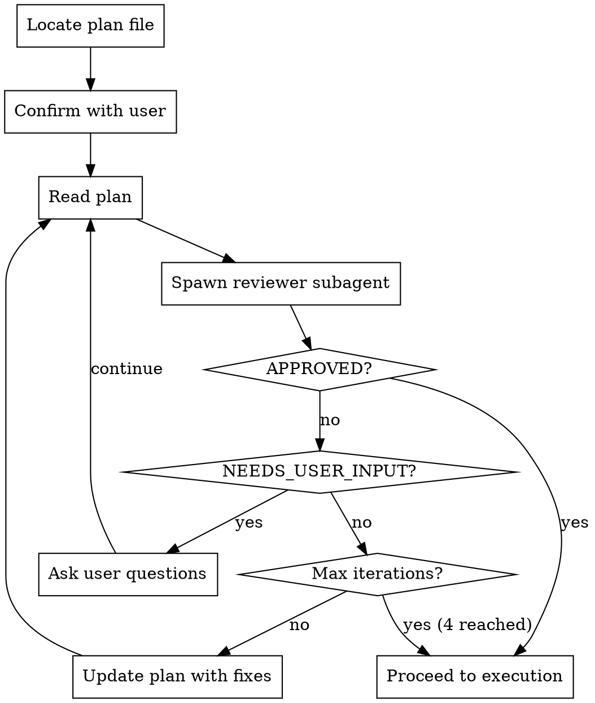

# Critique Plan

## Overview

Iterative adversarial review loop for implementation plans. Spawns a reviewer subagent to critique the plan, updates based on feedback, and repeats until approved or max iterations reached.

**Announce at start:** "Using critique-plan to review the implementation plan."

## When to Use

- After writing a plan in plan mode, before calling ExitPlanMode
- After using superpowers:writing-plans, before execution handoff
- When a plan feels too complex or has uncertain requirements
- When you want a second opinion on architectural decisions

## When NOT to Use

- Trivial plans (< 3 tasks, obvious implementation)
- Plans that are just lists of file edits with no architectural decisions
- When the user wants to skip review and execute immediately

## Workflow



## Step 1: Locate the Plan File

The plan file path is available from your plan mode system message context. Use it directly.

**If you do NOT have the plan file path** (e.g., skill invoked outside plan mode):

```bash
# Find most recently modified plan in global plans directory
ls -t ~/.claude/plans/*.md | head -1
```

Confirm with user: "I found plan: **[filename]**. Is this the plan to review?"

## Step 2: Read and Summarize

Read the full plan file. Before dispatching the reviewer, briefly summarize:
- Number of tasks
- Key architectural decisions
- Technologies involved

This summary goes to the user, not the subagent. The subagent gets the full plan.

## Step 3: Dispatch Reviewer Subagent

Use the Task tool to spawn a **new** Plan subagent each iteration with the reviewer prompt template from `critique-plan/plan-reviewer-prompt.md`.

```
Task tool:
  subagent_type: "Plan"
  description: "Review plan iteration N"
  prompt: [Fill plan-reviewer-prompt.md template with actual plan content]
```

### Clean Context Rules

- **ALWAYS spawn a new subagent** for each review round. NEVER resume a previous reviewer.
- **DO NOT include** previous round's review feedback, critique, or review log in the subagent prompt. Each reviewer sees only the current plan as-is.
- The reviewer must form its own independent opinion without being anchored by prior critiques.
- Previous round's fixes are already incorporated into the plan itself — that is the only way prior feedback flows forward.

**Why:** Passing old feedback biases the reviewer toward confirming previous issues were fixed rather than evaluating the plan fresh. A clean-context reviewer may catch entirely different problems that an anchored reviewer would miss.

### Code-Verified Suggestions Only

- **CRITICAL:** Pass the FULL plan content to the subagent. Do not summarize or truncate.
- The reviewer subagent has access to Glob, Grep, and Read tools. It MUST use them.
- Every suggestion in the review MUST cite actual code evidence (file paths, line numbers, function signatures found in the codebase).
- Suggestions without code evidence are invalid and should be discarded by the main agent.

## Step 4: Process Reviewer Response

The reviewer will respond with one of three verdicts:

### VERDICT: APPROVED
- Log: "Plan approved after N iteration(s)."
- Append review summary to the plan file as a `## Review Log` section
- Proceed to ExitPlanMode or execution handoff

### VERDICT: NEEDS_USER_INPUT
- Present the reviewer's questions to the user via AskUserQuestion
- After user responds, incorporate answers into the plan
- Continue the loop (counts as an iteration)

### VERDICT: ISSUES_FOUND
- List the issues found (numbered, with severity)
- Update the plan file addressing each issue
- Log changes in a `## Review Round N` section at the bottom of the plan
- Continue the loop

## Step 5: Iteration Control

- **Max iterations:** 4
- **Track iteration count** explicitly in your messages
- After each round, tell the user: "Review round N/4 complete. [summary of changes]"
- If max reached with unresolved issues, tell the user which issues remain and ask how to proceed

## Review Log Format

Append to the bottom of the plan file after each round:

```markdown
---

## Review Log

### Round 1 (ISSUES_FOUND)
- Fixed: [issue description]
- Fixed: [issue description]

### Round 2 (APPROVED)
- Plan approved. No remaining issues.
```

## Quick Reference

| Aspect | Details |
|--------|---------|
| Max iterations | 4 |
| Subagent type | Plan |
| Plan location | System message path OR `~/.claude/plans/` (most recent) |
| Exit conditions | APPROVED, max iterations, or NEEDS_USER_INPUT (after user responds) |
| Reviewer prompt | `critique-plan/plan-reviewer-prompt.md` |

## Common Mistakes

| Mistake | Fix |
|---------|-----|
| Summarizing plan for subagent | Always pass FULL plan content |
| Not tracking iteration count | Explicitly count and display "Round N/4" |
| Updating plan without logging | Always append to Review Log section |
| Running critique on trivial plans | Skip for plans with < 3 tasks and no decisions |
| Forgetting to confirm plan file | Always verify with user before starting |
| Resuming previous reviewer subagent | ALWAYS spawn a new subagent per round |
| Including prior review feedback in prompt | Only pass the current plan — no old critiques |
| Accepting suggestions without code evidence | Discard any suggestion that doesn't cite actual files/lines |

## Integration Points

- **Before:** superpowers:writing-plans (plan creation)
- **After:** ExitPlanMode or superpowers:executing-plans (execution)
- **Optional:** superpowers:brainstorming (if reviewer surfaces design questions)

## Red Flags - STOP the Loop

- Reviewer keeps finding the SAME issues across rounds (plan may need fundamental rethink)
- Each round introduces MORE issues than it fixes (architectural problem)
- User has answered the same clarification question twice (miscommunication)

If any red flag triggers, stop the loop and tell the user: "The review loop is not converging. Here's why: [explanation]. I recommend we step back and reconsider [specific aspect]."
