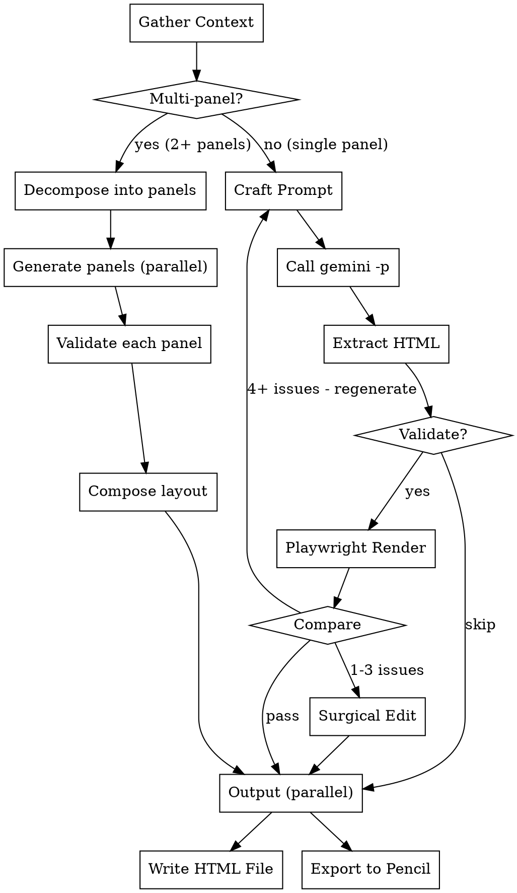

# Design Generation

Generate UI designs using Gemini as a rendering engine, Claude as orchestrator, and Playwright as visual validator.

## When to Use

- User asks to create a UI mockup or HTML/Tailwind prototype
- User wants to migrate an old design to match a new style reference
- User provides screenshot references and wants a new design generated
- User invokes `/ui-redesign` or asks for design generation

## When NOT to Use

- Simple CSS tweaks or color changes (just edit the code)
- No screenshot references provided (use interface-design skill directly)
- Gemini CLI not installed (`gemini --version` fails)

## Architecture

```
Claude (Orchestrator) → gemini -p (Renderer) → Playwright (Validator) ─┬→ HTML output
                                                                       └→ Pencil MCP (.pen editable)
```

**Why this split:**
- Gemini excels at visual design generation from image references
- Claude has project context, file access, and conversation history
- Playwright provides visual verification (layout, colors, responsive)
- Gemini headless mode is a pure function: prompt in → HTML out, no side effects

## Workflow



## Phase 1: Gather Context

Read ALL of these before constructing the prompt:

1. **Reference images** - Use Read tool on both old design and style reference PNGs
2. **Project code** - Read existing editor components (e.g., StoryEditor.tsx) to extract real design tokens
3. **Interface-design principles** - Read `~/.gemini/skills/interface-design/SKILL.md` for craft checks
4. **Shared components** - Check what reusable components exist in the project

```bash
# Identify existing components and patterns
ls src/frontend/components/touchpoint/modules/shared/
```

**Output of this phase:** You should be able to describe in plain text:
- What functionality the old design has (from the screenshot)
- What design tokens the new style uses (colors, radius, spacing, fonts)
- What existing project components can be reused

## Phase 1.5: Auto-Decompose Multi-Panel Designs

After gathering context, detect whether the design has multiple distinct panels. **This is automatic — do not ask the user whether to decompose.**

### Detection Rule
If the design description mentions **2 or more** of these, it's multi-panel:
- Editor/settings panel + Preview panel
- Sidebar + Main content
- Left panel + Right panel + Center
- Any layout with independently scrollable regions

### Why Decompose?
Gemini has a finite attention budget per generation. A single prompt for "editor + preview + sidebar" produces each panel at ~33% detail. Three separate prompts produce each at ~100% detail. Composition is deterministic (flexbox wrapper) and doesn't need AI.

**Tested evidence:** A single-prompt 3-panel design lost image placeholders, detailed SVG icons, and hover states on answer cards. The same editor generated alone had full detail.

### How to Decompose

1. **Identify panels** from the design description:
   ```
   Example: "Editor panel (left) + Phone Preview (center) + Step sidebar (right)"
   → Panel 1: Editor (~380px, scrollable)
   → Panel 2: Phone Preview (~340px, centered)
   → Panel 3: Step Sidebar (~80px, vertical)
   ```

2. **Generate each panel separately** using subagents (Task tool) for parallelism:
   - Each subagent gets the same design tokens and style reference
   - Each subagent's prompt focuses on ONE panel only
   - Each subagent validates its own panel independently

3. **Compose panels** after all pass validation:
   ```html
   <!-- Claude writes this wrapper — no Gemini needed -->
   <div class="flex h-screen">
     <aside class="w-[380px] ..."><!-- Panel 1 HTML --></aside>
     <main class="flex-1 ..."><!-- Panel 2 HTML --></main>
     <aside class="w-20 ..."><!-- Panel 3 HTML --></aside>
   </div>
   ```

4. **Final validation** on the composed result (Playwright if available)

### Single-Panel Designs
If the design is a single panel (e.g., "just the editor" or "just the preview"), skip decomposition and go directly to Phase 2.

## Phase 2: Craft Prompt

**CRITICAL:** Do NOT dump entire SKILL.md into the prompt. Distill what you learned into a focused spec.

**Good prompt structure:**
```
Generate an HTML/Tailwind mockup for [specific component].

Design tokens (extracted from style reference @style.png):
- Brand color: [hex]
- Card radius: [value]
- Input radius: [value]
- Font: [family and weights]
- Canvas: [background]
- Labels: [style]

Functional requirements (from old design @old.png):
- [Specific field 1]
- [Specific field 2]
- [Specific interaction]

Craft checks your output must pass:
- Squint Test: hierarchy readable at arm's length
- Token Test: only use the tokens listed above
- Signature: [one distinctive element]

@path/to/old-design.png
@path/to/style-reference.png

Output ONLY valid HTML with inline Tailwind CSS. No explanation, no markdown wrapping.
```

**Key rules:**
- Image paths use `@` prefix (Gemini's file reference syntax)
- Include explicit design tokens so Gemini doesn't guess
- End with "Output ONLY valid HTML" to avoid markdown wrapping
- Keep prompt under ~2000 words for best results

## Phase 3: Call Gemini

```bash
gemini -p "[your crafted prompt]" > /tmp/design-output.html
```

**If the prompt is too long for shell argument:**
```bash
# Write prompt to file, pipe via stdin
cat /tmp/design-prompt.txt | gemini -p "Execute the design instructions above. Output ONLY HTML."
```

**Important:** The `@path/to/image.png` references must be in the `-p` argument string, NOT in stdin. If piping a long prompt, keep image references in the `-p` flag:
```bash
cat /tmp/design-prompt.txt | gemini -p "Follow instructions from stdin. References: @old.png @new.png"
```

**Error handling:**
- 429 rate limit → Wait 30s and retry, or ask user to retry later
- Empty output → Prompt may be too long, simplify
- Markdown-wrapped output → Strip with: extract content between ```html and ``` markers

## Phase 4: Validate with Playwright

If Playwright MCP is available, use it for visual verification:

1. Write HTML to a temp file
2. Navigate Playwright to `file:///tmp/design-output.html`
3. Take screenshot
4. Read the screenshot and compare against the style reference

**What to check:**
- Colors match the specified tokens
- Layout hierarchy is clear (squint test)
- No overlapping elements or broken responsive layout
- Text is readable, interactive elements have proper sizing

**If Playwright is not available:** Read the HTML source and validate tokens manually (check hex values, class names against spec). This is weaker but still useful.

## Phase 5: Iterate or Finalize

**If validation passes:** Write to the user's requested location.

**If validation fails, choose fix strategy based on failure count:**

### Small failures (1-3 items): Surgical Claude Edit
**PREFER THIS.** Use Claude's Edit tool to directly fix the HTML. Gemini regeneration for small fixes causes regressions — it may restructure the entire layout, losing working elements.

```
Validation: 18/20 passed
Missing: Required toggle, Background color picker
→ Claude surgically adds both elements to existing HTML
→ Result: 20/20, no regressions
```

### Large failures (4+ items or structural): Gemini Regeneration
Refine the prompt with specific corrections and regenerate:
```
Previous output had these issues:
- Cards use rounded-lg instead of rounded-2xl
- Missing brand color #9646ff on active states
- Layout breaks below 375px width

Please regenerate with these corrections.
@old.png @style.png
```

Maximum 3 iterations. If still failing after 3, present best result with noted issues.

### Why surgical edits over regeneration?
Tested during skill validation: asking Gemini to regenerate full HTML to fix 2 missing elements caused it to restructure from a 3-panel layout to single-panel, losing the phone preview entirely. Surgical edits preserve what works.

## Phase 6: Export to Pencil (parallel with HTML output)

After validation passes, export the design to Pencil in parallel with writing the HTML file. Both outputs come from the same validated design spec.

### Steps

1. **Get Pencil guidelines** — Call `get_guidelines(topic="web-app")` to understand .pen node schema
2. **Create .pen file** — Call `open_document("new")` to create a fresh canvas
3. **Translate design to Pencil nodes** — Use `batch_design` to build the design:
   - Map HTML layout structure → Pencil frames with `layout: "horizontal"/"vertical"`, `gap`, `padding`
   - Map text elements → Pencil `text` nodes with `content`, `fontSize`, `fontWeight`, `fill`
   - Map colors/backgrounds → `fill` properties on frames
   - Map border-radius → `cornerRadius` on frames
   - Map images → frame + `G()` operation for stock/AI images
4. **Verify** — Use `get_screenshot` to visually confirm the Pencil output matches

### HTML-to-Pencil Translation Reference

| HTML/Tailwind | Pencil .pen |
|---------------|-------------|
| `<div class="flex flex-col gap-4 p-6">` | `{type: "frame", layout: "vertical", gap: 16, padding: 24}` |
| `<div class="flex flex-row">` | `{type: "frame", layout: "horizontal"}` |
| `<p class="text-sm text-gray-600">` | `{type: "text", fontSize: 14, fill: "#4B5563"}` |
| `<div class="bg-white rounded-2xl">` | `{type: "frame", fill: "#FFFFFF", cornerRadius: 16}` |
| `<div class="w-full">` | `{width: "fill_container"}` |
| `<div class="w-[300px] h-[200px]">` | `{width: 300, height: 200}` |
| `<h1 class="text-2xl font-bold">` | `{type: "text", fontSize: 24, fontWeight: 700}` |
| `<input placeholder="...">` | `{type: "frame", cornerRadius: 8, stroke: "#D1D5DB", padding: 12, children: [{type: "text", ...}]}` |

### Tailwind Spacing Scale (for reference)

| Tailwind | px | Tailwind | px |
|----------|-----|----------|-----|
| `gap-1` / `p-1` | 4 | `gap-6` / `p-6` | 24 |
| `gap-2` / `p-2` | 8 | `gap-8` / `p-8` | 32 |
| `gap-3` / `p-3` | 12 | `gap-10` / `p-10` | 40 |
| `gap-4` / `p-4` | 16 | `gap-12` / `p-12` | 48 |

### Example: Translating a card component

**HTML input (validated):**
```html
<div class="bg-white rounded-2xl p-6 flex flex-col gap-4">
  <h2 class="text-lg font-semibold text-gray-900">Question Title</h2>
  <p class="text-sm text-gray-500">Optional description</p>
  <div class="flex gap-3">
    <button class="bg-purple-600 text-white rounded-xl px-4 py-2">Option A</button>
    <button class="bg-gray-100 text-gray-700 rounded-xl px-4 py-2">Option B</button>
  </div>
</div>
```

**Pencil batch_design operations:**
```javascript
card=I("parentFrame", {type: "frame", layout: "vertical", gap: 16, padding: 24, fill: "#FFFFFF", cornerRadius: 16})
title=I(card, {type: "text", content: "Question Title", fontSize: 18, fontWeight: 600, fill: "#111827"})
desc=I(card, {type: "text", content: "Optional description", fontSize: 14, fill: "#6B7280"})
btnRow=I(card, {type: "frame", layout: "horizontal", gap: 12})
btnA=I(btnRow, {type: "frame", cornerRadius: 12, fill: "#9333EA", paddingLeft: 16, paddingRight: 16, paddingTop: 8, paddingBottom: 8})
btnALabel=I(btnA, {type: "text", content: "Option A", fill: "#FFFFFF"})
btnB=I(btnRow, {type: "frame", cornerRadius: 12, fill: "#F3F4F6", paddingLeft: 16, paddingRight: 16, paddingTop: 8, paddingBottom: 8})
btnBLabel=I(btnB, {type: "text", content: "Option B", fill: "#374151"})
```

### When Pencil MCP is unavailable

If Pencil MCP tools are not connected, skip this phase silently. The HTML output is the primary deliverable — Pencil export is a bonus for visual tweaking.

## Quick Reference

| Step | Tool | What |
|------|------|------|
| Read images | Read | Understand old + new design |
| Read project code | Read/Glob | Extract real tokens and components |
| Read design principles | Read | `~/.gemini/skills/interface-design/SKILL.md` |
| **Decompose (auto)** | **Claude** | **If 2+ panels detected, split into separate prompts** |
| Craft prompt | Claude | Distill tokens + requirements into focused prompt |
| Generate | `gemini -p "@img"` | Gemini renders HTML (pure function) — use Task tool for parallel panels |
| Validate | Playwright MCP | Render HTML → screenshot → compare |
| Compose (if decomposed) | Claude | Wrap validated panels in flexbox layout shell |
| Write HTML output | Write | Save final HTML to target location |
| **Export to Pencil** | **Pencil MCP** | **Translate validated design to .pen for visual tweaking** |

## Common Mistakes

| Mistake | Fix |
|---------|-----|
| Pass image path as plain text string | Use `@path/to/image.png` syntax |
| Dump entire SKILL.md into prompt | Distill relevant tokens and principles only |
| Use `gemini` agent mode (no `-p` flag) | Always use `gemini -p` for headless, pure-function execution |
| Skip reading images before prompting | Read both references first so you can write precise token specs |
| No validation step | Always validate with Playwright or manual HTML review |
| Retry same failing prompt | Identify specific issue, add correction to prompt |
| Ask Gemini to regenerate for 1-2 small fixes | Use Claude's Edit tool for surgical fixes — regeneration causes regressions |
| Generate multi-panel design in a single prompt | Auto-decompose into separate panel prompts — each gets full attention budget |

## Dependencies

| Dependency | Required | Check | Purpose |
|------------|----------|-------|---------|
| Gemini CLI | Yes | `gemini --version` | Design generation engine |
| Gemini auth | Yes | `gemini -p "test"` succeeds | API access |
| Playwright MCP | Recommended | Check MCP tool availability | Visual validation |
| Pencil MCP | Optional | `get_editor_state` succeeds | Editable .pen design output for visual tweaking |
| interface-design skill | Recommended | `~/.gemini/skills/interface-design/SKILL.md` | Design principles for prompt crafting and validation |
