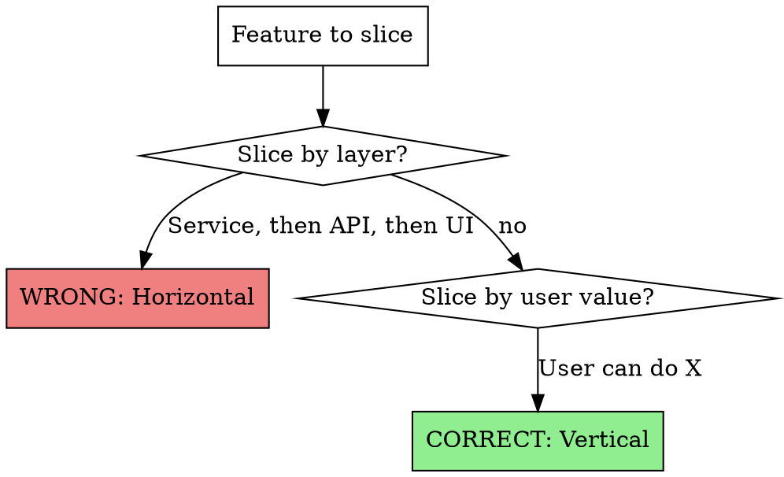

# Spec Slicing

Transform requirements into vertical, independent slices with Given/When/Then acceptance criteria.

**Core principle:** Each slice delivers user value and can ship alone.

## When to Use

- Have a design doc, PRD, or requirements
- Need to break work into implementable pieces
- Want acceptance criteria that become tests

## The Process

### 1. Identify Business Goals

Extract goals from requirements. Every slice must trace to a goal.

```markdown
| ID | Goal | Priority |
|----|------|----------|
| G1 | [What user/business outcome] | Must-have |
| G2 | [What user/business outcome] | Must-have |
```

### 2. Slice Vertically (NOT Horizontally)



**Vertical slice test:** Can a user do something valuable when ONLY this slice ships?

| Slice Type | Example | Ships Value? |
|------------|---------|--------------|
| ❌ Horizontal | "Create ExportService" | No - user sees nothing |
| ❌ Horizontal | "Add API endpoint" | No - nothing calls it |
| ❌ Horizontal | "Create utility function" | No - infrastructure only |
| ✅ Vertical | "User can export survey to CSV" | Yes - complete feature |
| ✅ Vertical | "User can filter by date before export" | Yes - usable enhancement |

### 3. Write Given/When/Then (NOT Checkboxes)

Each slice needs acceptance criteria in Given/When/Then format.

**❌ WRONG: Checkbox format**
```markdown
- [ ] Endpoint exists
- [ ] Returns CSV file
- [ ] Handles errors gracefully
```
Problems: Not testable, vague, can't become test code.

**✅ CORRECT: Given/When/Then format**
```gherkin
Given I am a brand admin viewing survey "Customer Feedback"
And the survey has 50 responses
When I click "Export to CSV"
Then a CSV file downloads to my browser
And the file contains 50 data rows plus header
```
Benefits: Directly becomes test code, unambiguous, verifiable.

**Given/When/Then → Test Code:**

```typescript
describe('AC1: Successful export', () => {
  it('downloads CSV with all responses', async () => {
    // Given: brand admin viewing survey with 50 responses
    const survey = await createSurvey('Customer Feedback');
    await createResponses(survey.id, 50);

    // When: click "Export to CSV"
    const response = await request(app)
      .post(`/api/brand/surveys/${survey.id}/export`);

    // Then: CSV file downloads with 50 data rows plus header
    expect(response.status).toBe(200);
    expect(response.headers['content-type']).toBe('text/csv');
    const rows = parseCSV(response.body);
    expect(rows.length).toBe(51); // 50 data + 1 header
  });
});
```

### 4. Verify Independence

For each slice, answer: "Can this ship without other slices?"

```markdown
| Slice | Ships Alone? | Dependencies | Resolution |
|-------|--------------|--------------|------------|
| 1. Basic export | ✅ Yes | None | - |
| 2. Date filtering | ✅ Yes | None | Works with or without Slice 1 |
| 3. Progress bar | ⚠️ Needs export | Slice 1 | Ship together or after |
```

If a slice has dependencies, either:
- Merge it with the dependency
- Reorder so dependency ships first
- Question if it's truly a separate slice

### 5. Output Format

```markdown
## Slice 1: [User-Valuable Name]

**User Story:** As a [role], I can [action], so that [benefit].

**Business Goal:** G1, G2

**Acceptance Criteria:**

### AC1: [Scenario name]
```gherkin
Given [context]
When [action]
Then [outcome]
```

### AC2: [Edge case]
```gherkin
Given [context]
When [action]
Then [outcome]
```

**Independence:** ✅ Can ship alone / ⚠️ Depends on [slice]
```

## Red Flags - STOP and Reslice

- Tasks named after code artifacts ("Create XService", "Add Y endpoint")
- First task is "infrastructure" or "foundation"
- Acceptance criteria are checkbox lists
- No Given/When/Then in any slice
- Can't trace slice back to a business goal
- "Recommended implementation order" with long dependency chains

## Rationalization Table

| Excuse | Reality |
|--------|---------|
| "Need foundation first" | Vertical slices include their own foundation |
| "More efficient to build service layer first" | Efficiency means shipping value, not building infrastructure |
| "Dependencies are natural" | Dependencies indicate horizontal slicing |
| "This is how the codebase is structured" | Slice by value, implement across layers |
| "Checkboxes are clearer" | Checkboxes can't become tests |

## Handoff

After slicing, use `superpowers:writing-plans` for detailed implementation steps per slice.
