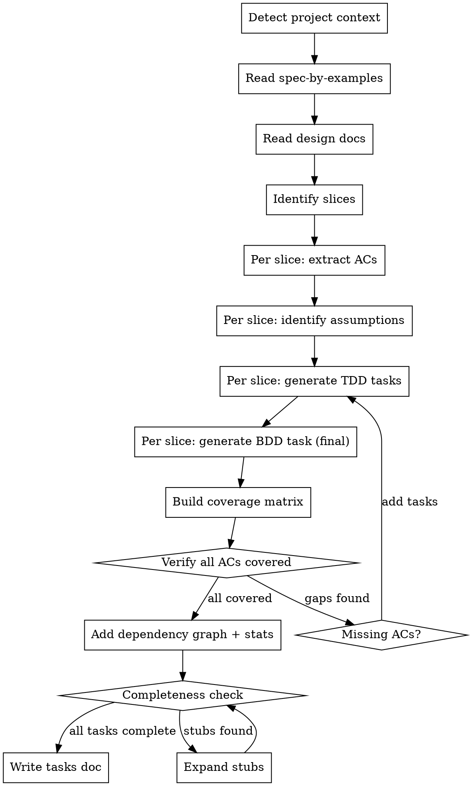

# Spec to Tasks

## Overview

Transform spec-by-examples and design docs into independent, TDD-based implementation tasks organized by vertical slice. Each slice ends with a BDD integration test that verifies acceptance criteria against real application code (mocked only at the DB boundary).

**Announce at start:** "I'm using the spec-to-tasks skill to generate implementation tasks from specs."

## When to Use

- You have a `spec-by-examples.md` with Given/When/Then acceptance criteria
- You have design docs (from brainstorming, plan mode, or `docs/plans/`)
- You need implementation tasks that are independent and vertically sliced
- You want spec traceability (every AC maps to a task)

## Inputs

Gather these before generating tasks:

1. **Spec-by-examples** — `docs/specs/spec-by-examples.md` (Given/When/Then ACs per slice)
2. **Design docs** — `docs/plans/*.md` (architecture, schemas, API design)
3. **Master plan** — `~/.claude/plans/*.md` (if exists, from plan mode)
4. **Spec requirements** — `docs/specs/spec-requirements.md` (if exists, REQ-level requirements)

## Output Format

Save to: `docs/plans/YYYY-MM-DD-<feature>-tasks.md`

```markdown
# [Feature] Implementation Tasks

> **For Claude:** REQUIRED SUB-SKILL: Use superpowers:executing-plans to implement this plan task-by-task.

**Goal:** [One sentence]

**Architecture:** [2-3 sentences]

**Tech Stack:** [Key technologies]

**MCP Servers:** [List required MCP servers. Include `Playwright` for any task with UI files]

**Source Specs:**
- `docs/specs/spec-by-examples.md`
- `docs/plans/YYYY-MM-DD-*-design.md`

**Project Context (auto-detected):**
- Test runner: [vitest|jest|other] (from [config file])
- Component library: [shadcn/radix/mui/custom] (from package.json)
- API pattern: [pattern from CLAUDE.md]
- DB: [supabase|prisma|drizzle] (from package.json)
- i18n: [library + locales] or "none detected"
- Key libraries: [list libraries relevant to the feature]
- Import aliases: [from tsconfig.json paths]
- Mandatory patterns: [summary from CLAUDE.md]

---

## Assumptions

| ID | Assumption | Impact if Wrong | Slice |
|----|-----------|-----------------|-------|
| A1 | [What you assumed] | [What breaks] | Slice N |

---

## Coverage Matrix

| AC | Description | Task | Status |
|----|-------------|------|--------|
| S1-AC1 | [Short description] | Task 1.1 | pending |
| S1-AC2 | [Short description] | Task 1.2, 1.3 | pending |

---

## Slice 1: [Slice Name]

### Task 1.1: [Component Name]

**Traces to:** S1-AC1, S1-AC2 (REQ-1)
**Assumes:** A1 — [brief restatement]
**Tools:** Context7 (json-render API docs), Playwright (visual verification after render)
**Files:** ...

[...standard writing-plans TDD steps with COMPLETE code...]

### Task 1.N: BDD Integration Test — [Slice Name]

**Traces to:** S1-AC1 through S1-ACn
**Type:** BDD
**Tools:** [detected test runner] (use project's test framework)

[...BDD test task with COMPLETE code...]

---

## Dependency Graph

[ASCII-art showing task ordering and dependencies across slices]

## Summary Statistics

| Slice | Tasks | Tests | New Files | Modified Files |
|-------|-------|-------|-----------|----------------|
| ...   | ...   | ...   | ...       | ...            |
| **Total** | **N** | **~N** | **N** | **N** |
```

## The Iron Law: Every Task Must Be Complete

**Every task MUST have complete, runnable test code and implementation code or clear implementation instructions. No stubs, summaries, or placeholders.**

Red flags — STOP and expand:
- "These tasks follow the same TDD pattern" (summarizing instead of writing)
- "(Tests the full export flow with mocked DB boundary.)" (placeholder instead of code)
- Task body with only `**Traces to:**` and no Steps/Code sections
- "Standard TDD cycle + commit" without the actual test code

**Why this matters:** Tasks are consumed by execution agents. A stub task forces the executing agent to design the test and implementation from scratch, defeating the purpose of this skill. The baseline agent (without this skill) naturally writes complete tasks — this skill must do at least as well.

**If running low on output space:** Split the document into multiple writes rather than abbreviating tasks.

## Process



### Step 0: Detect Project Context

Before generating any tasks, read project configuration to build a **Project Context** block. This ensures all generated code uses the correct test runner, import aliases, libraries, and project-mandated patterns.

**Read these files (skip any that don't exist):**

| File | What to Extract |
|------|----------------|
| `CLAUDE.md` (project root) | Mandatory coding patterns, API conventions, brand identification patterns |
| `package.json` | Test runner (`vitest` vs `jest` in deps/devDeps), component library, DB client, i18n library, key dependencies |
| `vitest.config.*` or `jest.config.*` | Confirm test framework; extract test setup files, globals, environment |
| `tsconfig.json` | `compilerOptions.paths` for import aliases (e.g., `@frontend/*`, `@backend/*`) |
| `messages/` directory or i18n config | Locale files, supported languages, translation key patterns |
| `next.config.*` or framework config | Framework-specific settings (e.g., `next-intl` plugin) |

**Build the Project Context block** from detected values. Use "none detected" for anything not found. This block goes into the output header and governs all generated code:

- **Test runner:** Use the detected runner's API in all test code (`vi.fn()` / `vi.mock()` for Vitest, `jest.fn()` / `jest.mock()` for Jest)
- **Import aliases:** Use detected path aliases in all `import` statements instead of relative paths
- **i18n:** If detected, flag user-facing string tasks with "i18n: translation keys needed for [locales]"
- **Mandatory patterns:** Reference CLAUDE.md patterns in relevant tasks (e.g., "Use TanStack Query per CLAUDE.md" for API tasks)

### Step 1: Read All Inputs

Read spec-by-examples, design docs, master plan, and spec-requirements. Build a mental model of slices, ACs, and architecture.

### Step 2: Per Slice — Extract and Map

For each slice in spec-by-examples:
1. List all ACs with their REQ references
2. Identify which design doc sections inform implementation
3. Note any assumptions not explicitly stated in specs

### Step 3: Per Slice — Generate TDD Tasks

**REQUIRED SUB-SKILL:** Use `superpowers:writing-plans` format for each task (bite-sized TDD steps: write failing test, verify fail, implement, verify pass, commit).

Each task must include:
- **Traces to:** which ACs it satisfies
- **Assumes:** which assumptions it depends on (with inline restatement)
- **Tools:** which MCP servers/tools to use (see Tool Detection Matrix below)
- **Files:** exact paths to create/modify/test (using detected import aliases for imports)
- **Steps:** full TDD cycle with **complete test code and implementation code**

All generated code must:
- Use the detected test runner API (from Step 0)
- Use detected import aliases (from Step 0)
- Follow mandatory patterns from CLAUDE.md (from Step 0)
- Flag i18n translation needs for user-facing strings (if i18n detected in Step 0)

### Step 4: Per Slice — Generate BDD Integration Test (Final Task)

The **last task** in every slice is a BDD integration test that:
- Tests the slice's ACs end-to-end through real application code
- Mocks **only at the DB boundary** (e.g., Supabase client)
- Keeps real: API routes, services, repositories, validation (Zod), React components
- Uses Given/When/Then structure matching spec-by-examples
- Uses the detected test runner API (not hardcoded jest/vitest)
- **Must include complete test code** — not a placeholder

```typescript
// BDD test structure — adapt mock API to detected test runner
describe('Slice N: [Slice Name]', () => {
  describe('AC1: [AC description]', () => {
    it('Given [context] When [action] Then [outcome]', async () => {
      // Given: set up state with DB mock
      // Use vi.fn() for Vitest, jest.fn() for Jest — per Project Context
      mockSupabaseClient.from('table').select.mockResolvedValue({
        data: [...], error: null
      });

      // When: call through real application code
      const response = await request(app)
        .post('/api/endpoint')
        .send(payload);

      // Then: verify observable behavior
      expect(response.status).toBe(201);
      expect(response.body).toMatchObject({ ... });
    });
  });
});
```

### Step 5: Build Coverage Matrix

After all tasks are generated, build the coverage matrix table. Every AC from spec-by-examples must appear at least once. Flag any gaps.

### Step 6: Record Assumptions

Two locations:
1. **Summary table** at the top of the tasks doc (all assumptions)
2. **Inline** in each task that depends on the assumption (`**Assumes:** A1 — ...`)

### Step 7: Add Dependency Graph + Summary Statistics

**Dependency Graph:** ASCII-art showing task ordering within and across slices. Show which tasks block which, and which slices can run in parallel.

**Summary Statistics:** Table with per-slice counts of tasks, tests, new files, and modified files, plus a total row. This helps estimate scope.

### Step 8: Completeness Check

Before writing the final document, scan every task. If any task is a stub (no test code, no implementation code, or just a description), expand it fully. If output space is limited, split the document across multiple file writes rather than abbreviating.

## Tool Detection Matrix

Annotate each task's `**Tools:**` line based on what the task touches. Detection is driven by the Project Context from Step 0 — do not assume tools, detect from the project.

| Task Signal | Tool | When to Use |
|-------------|------|-------------|
| Creates/modifies `.tsx` with visual output | `Playwright` | Visual verification of rendered components |
| Uses a library listed in Project Context | `Context7` with library name | Official docs for correct API usage |
| Complex multi-step logic or state machines | `Sequential` | Structured reasoning for implementation |
| UI component composition | Design system MCP (if detected) | Component patterns and variants |
| API route handler | Reference `CLAUDE.md` | Project-specific conventions |
| Database migration or repository code | `Context7` for DB library | Schema patterns, RLS, migrations |
| Test file | Detected test runner | Use project's test framework (`vi.fn` vs `jest.fn`) |
| User-facing strings (if i18n detected) | Note i18n requirement | Flag translation keys needed for [detected locales] |
| New library integration | Context7 / node_modules / WebSearch | **MANDATORY**: Verify full API (providers, wrappers, initialization) before generating code |

**Priority:** Tool preferences declared in `CLAUDE.md` override auto-detection. For example, if CLAUDE.md says "use Magic MCP for UI components", annotate UI tasks with Magic MCP instead of the generic "Design system MCP" row.

**Rules for annotation:**
- List only tools relevant to the specific task, not every possible tool
- Include the library or topic name with Context7 (e.g., "Context7 (next-intl setup)")
- If CLAUDE.md mandates a pattern for the task type, reference it (e.g., "Per CLAUDE.md: use TanStack Query")
- If i18n is detected and the task creates user-facing UI, add: "i18n: keys needed for [locales]"

### Library API Verification (Mandatory)

Before generating ANY task code that uses an external library:
1. Resolve the library via Context7 or read `node_modules/<lib>/README.md`
2. Verify: required providers/wrappers, correct import paths, initialization steps
3. Include verification evidence in the task (e.g., "Verified via Context7: Renderer requires StateProvider > VisibilityProvider > ActionProvider > ValidationProvider")
4. For React libraries: always check if components need context providers
5. Add a task for at least 1 integration test using the REAL library (minimal mocking)

## BDD Mock Boundary

```
Real (tested):          Mocked (boundary):
  API Route Handler       Supabase Client
  Service Layer           External APIs
  Repository Layer        File System
  Zod Validation          Email/SMS Services
  React Components
  Context Providers
```

Mock at infrastructure boundaries. Everything above the boundary runs as real code.

## Independence Check

Before finalizing, verify each slice's tasks can be implemented independently:

| Check | Pass? |
|-------|-------|
| No task references another slice's code | Required |
| Each slice has its own BDD test | Required |
| Shared utilities extracted to a common task if needed | Optional |
| Tasks within a slice can run sequentially | Required |

If slices share a dependency (e.g., a shared type or context), extract it as "Slice 0: Shared Foundation" with its own tasks and BDD test.

## Execution Handoff

After saving the tasks doc, offer the same execution choice as writing-plans:

**"Tasks complete and saved. Two execution options:**
1. **Subagent-Driven (this session)** — REQUIRED SUB-SKILL: `superpowers:subagent-driven-development`
2. **Parallel Session (separate)** — REQUIRED SUB-SKILL: `superpowers:executing-plans`

**Which approach?"**
